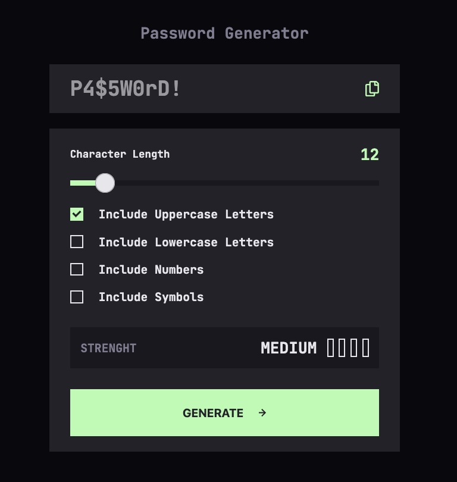

# Frontend Mentor - Password generator app solution

This is a solution to the [Password generator app challenge on Frontend Mentor](https://www.frontendmentor.io/challenges/password-generator-app-Mr8CLycqjh). Frontend Mentor challenges help you improve your coding skills by building realistic projects.

## Table of contents

- [Overview](#overview)
  - [The challenge](#the-challenge)
  - [Screenshot](#screenshot)
  - [Links](#links)
- [My process](#my-process)
  - [Built with](#built-with)
  - [What I learned](#what-i-learned)
  - [Useful resources](#useful-resources)
- [Author](#author)

## Overview

### The challenge

Users should be able to:

- Generate a password based on the selected inclusion options
- Copy the generated password to the computer's clipboard
- See a strength rating for their generated password
- View the optimal layout for the interface depending on their device's screen size
- See hover and focus states for all interactive elements on the page

### Screenshot

### Links

- Solution URL: [Solution](https://github.com/vince4dev/challenge13)
- Live Site URL: [Live site](https://vince4dev.github.io/challenge13/)

## My process

### Built with

- Semantic HTML5 markup
- CSS custom properties
- Flexbox
- CSS Grid
- Mobile-first workflow
- Javascript

### What I learned

What I Learned While Building the Password Generator App (Frontend Mentor Challenge)

1. Customizing an input[type="range"] (slider)

- Hide the native slider track and thumb with appearance: none.
- Styled the track (::-webkit-slider-runnable-track / ::-moz-range-track) with a linear gradient that fills from left to the current cursor position (calc(var(--cursor-percentage))). The gradient changes color from green (filled) to grey (unfilled).
- Created a thumb (::-webkit-slider-thumb / ::-moz-range-thumb) with custom size, radius, cursor, and background color. The thumb’s vertical position is calculated to center it on the track (margin-top: calc((var(--range-track-height) - var(--range-thumb-size)) / 2)).
- Added hover and focus-visible states that change the thumb’s background to dark grey and add a green border, improving visual feedback.
- Ensured cross‑browser compatibility by providing separate styles for WebKit (Chrome/Safari) and Gecko (Firefox).

2. Customizing an input[type="checkbox"]

- Visually hidden the native checkbox (position: absolute; opacity: 0; width: 0; height: 0;).
- Created a custom switch using a <label> that contains a .box element styled with border, background, and transition.
- Added a pseudo‑element (::after) that draws the checkmark via borders and rotation, showing only when the checkbox is checked (opacity: 1).
- Implemented focus styles with focus-visible to change border and background colors for accessibility.
- The final CSS (shown above) provides a clean, animated toggle that changes color from grey to green when checked and includes focus outlines for keyboard users.

3. Embedding an SVG directly in the code

- Included the icon inline inside the JSX/HTML (e.g., a lock or copy icon).
- Used an \<svg> element with viewBox, xmlns and a \<path> whose fill="currentColor" allows the icon to inherit text color.
- Styled the SVG with CSS (size, margin, hover effects) without needing external requests.
- This keeps the bundle size small and ensures the icon is available immediately on load.

In short, this project taught me how to replace native form controls with fully custom, animated components while keeping accessibility intact. I learned to blend modern CSS, reactive JavaScript, and inline SVGs to deliver an interface that is both beautiful and functional.

### Useful resources

- [google-webfonts-helper](https://gwfh.mranftl.com/fonts) - This helped me find the font and integrate it into the project.
- [MDN](https://developer.mozilla.org/fr/) - Resources for Developers.

## Author

- Frontend Mentor - [@vince4dev](https://www.frontendmentor.io/profile/vince4dev)
